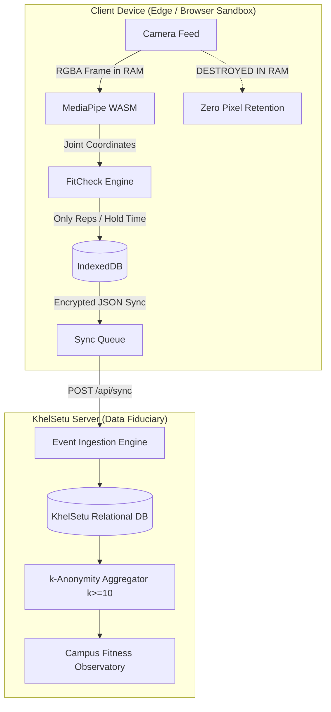

# KhelSetu — DPDP Act 2023 Compliance & Data Protection Runbook

> **Standard Operating Procedure & Legal Architecture**  
> Governing the collection, edge processing, storage, and erasure of collegiate digital fitness data under the **Digital Personal Data Protection (DPDP) Act, 2023 (India)**.

---

## 1. Executive Summary & Privacy Principles

KhelSetu is architected according to the statutory mandates of the **DPDP Act, 2023**. Its foundational design principle is **Data Minimisation via Edge Computing (§4 & §6)**:
- **Zero Video Transmission**: Camera frames are processed strictly in-memory within client-side WebAssembly (`PoseLandmarker Lite`). Raw video pixels never traverse the network and are never written to disk.
- **Strict 18+ Adult Deployment (§9)**: To eliminate verifiable parental consent overhead and risk to minors during hackathon pilot phases, user onboarding strictly enforces an adult gate ($\ge 18$ years of age).
- **$k$-Anonymity Aggregate Reporting ($k \ge 10$)**: Institutional dashboards and physical education authorities see only aggregated group statistics. Any cohort smaller than 10 students is suppressed into an aggregate "Other" pool to prevent re-identification.

---

## 2. Legal Alignment Matrix (DPDP Act, 2023)

| DPDP Section | Legal Requirement | KhelSetu Architecture / Mitigation | Verification Endpoint |
|---|---|---|---|
| **Section 5** | Notice & Language Accessibility | Multi-lingual pre-consent notice in plain English & Hindi explaining purpose, data retention, and rights. | Onboarding screen (`viewOnboard`), [`i18n.js`](file:///d:/Projects/khelsetu/frontend/i18n.js) |
| **Section 6** | Specified, Free & Informed Consent | Granular purpose checkboxes (`fitness_assessment`, `activity_tracking`). Consent record timestamped and versioned (`CONSENT_VERSION = "2026-10-v1"`). | `POST /api/register`, `POST /api/auth/otp/verify` |
| **Section 8** | General Obligations of Data Fiduciary | Reasonable security safeguards, tenant isolation by `institution_id`, immutable audit logging for administrative views. | `backend/main.py` (`audit` function) |
| **Section 9** | Processing of Children's Personal Data | Hard age gating requiring explicit confirmation of age $\ge 18$. Accounts under 18 rejected with HTTP 403. | `b.age_confirmed_18` check in registration |
| **Section 11** | Right to Information & Access | One-click complete personal data dump (JSON export) including all consents, goals, activity events, and assessments. | `GET /api/me/export` |
| **Section 12** | Right to Correction and Erasure | "Right-to-be-Forgotten" erasure wiping server records across all tables and purging local IndexedDB storage. | `POST /api/me/delete` |
| **Section 13** | Grievance Redressal Mechanism | Direct squad abuse and offensive content reporting routed directly to campus moderation logs. | `POST /api/squads/{id}/report` |

---

## 3. Data Flow & Boundary Architecture



---

## 4. Standard Operating Procedures (SOPs)

### SOP-01: Data Subject Access Request (DSAR)
1. **Trigger**: User requests an export of their stored personal data.
2. **Execution**:
   - In PWA: Navigate to **Privacy** $\rightarrow$ Click **"Download my data"**.
   - Offline Mode: PWA dumps the complete IndexedDB event history into `khelsetu-my-data.json`.
   - Online Mode: Server queries all rows associated with `user_id` across `consents`, `screenings`, `assessments`, `activity_events`, and `goals`, and returns an authenticated JSON document.
3. **Audit**: System logs `audit(c, uid, "export")`.

### SOP-02: Right-to-be-Forgotten (Account Erasure)
1. **Trigger**: User requests immediate erasure of their account.
2. **Execution**:
   - In PWA: Navigate to **Privacy** $\rightarrow$ Click **"Delete my data"** $\rightarrow$ Confirm prompt.
   - Endpoint `POST /api/me/delete` executes transactional cascading deletion:
     ```sql
     DELETE FROM squad_members WHERE user_id = :uid;
     DELETE FROM assessments WHERE user_id = :uid;
     DELETE FROM activity_events WHERE user_id = :uid;
     DELETE FROM goals WHERE user_id = :uid;
     DELETE FROM screenings WHERE user_id = :uid;
     DELETE FROM consents WHERE user_id = :uid;
     DELETE FROM users WHERE id = :uid;
     ```
   - Client executes `wipeAll()`, clearing IndexedDB object stores and authentication tokens.
3. **Audit**: System records `audit(c, "system", "delete_user", "user data erased on request")`.

### SOP-03: Data Protection Officer (DPO) Incident & Breach Handling
1. **Containment**: If any unauthorized administrative access or API key compromise is suspected:
   - Rotate the administrative master key `ADMIN_KEY`.
   - Invalidate active authentication tokens by executing an HMAC secret rotation.
2. **Notification Mandate**: Under DPDP §8(6), in the event of a personal data breach, the Data Fiduciary shall give the Data Protection Board of India and each affected Data Principal intimation in the prescribed form within 72 hours.

---

## 5. Security Safeguards & Integrity Assurances

1. **Tamper-Evident Hashing**: Assessment events include integrity verification scores and timing variance indicators.
2. **Rate Limiting & Abuse Prevention**: Token-bucket sliding window rate limiting protects sensitive endpoints against automated harvesting.
3. **Persistent Offline Storage**: `navigator.storage.persist()` ensures that local data is safeguarded against unexpected browser eviction while maintaining strict user control.
