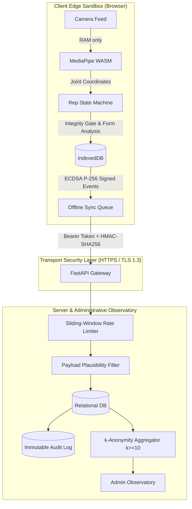

# KhelSetu: Threat Model & Security Posture (STRIDE Analysis)

---

## 1. Asset Inventory & Trust Boundaries

| Asset | Storage Location | Sensitivity | Threat Vectors | Mitigations |
| :--- | :--- | :--- | :--- | :--- |
| **Camera Video / Pixels** | Volatile RAM only (MediaPipe WASM) | **Critical** (Biometric / Private Room) | Eavesdropping, unauthorized upload, network inspection | **Never written to disk or network**. No video ingest endpoints exist. Silhouette Mode renders vector lines on a dark canvas. |
| **Health Screening Answers (PAR-Q)** | Local device RAM only | **High** (Medical disclosure) | Third-party snooping, institutional bias | Only binary outcome (*cleared* / *gentle*) leaves device. Answers discarded immediately from memory. |
| **Workout Logs & Reps** | Client IndexedDB + Server SQLite/Postgres | **Medium** (Behavioral habit) | Tampering, replay attacks, spoofing | Client-side ECDSA P-256 cryptographic signatures, server-side rate limits, plausibility bounds, HMAC-signed tokens. |
| **Institutional Analytics** | Server SQLite / Admin Endpoint | **Medium** (Cohort aggregate) | Subtraction / Differencing attacks | $k$-Anonymity ($k \ge 10$) with complementary suppression and visible-cohort-only total calculations. |
| **Officer QR / Session Codes** | Volatile DB table with 4h TTL | **Medium** (Attendance credential) | Code sharing, replay after session expiry | 4-hour automatic expiration, institutional tenant validation, idempotent single check-in per user per session. |

---

## 2. STRIDE Threat Analysis & Architectural Mitigations

### A. Spoofing & Identity
* **Threat**: An attacker impersonates a student or creates fake user accounts using arbitrary roll numbers or emails.
* **Mitigation**: Multi-factor OTP verification (`/api/auth/otp/send`, `/api/auth/otp/verify`) tied to institutional domains with time-limited OTP tokens (10-minute expiry) and single-use consumption.
* **Cryptographic Event Proof**: Client generates an on-device ECDSA P-256 keypair via Web Crypto API and signs every synced activity and assessment event.

### B. Tampering & Integrity Gaming
* **Threat**: A rogue script attempts to inject 500 push-ups in 10 seconds or simulate unnatural robotic tempos.
* **Mitigation**:
  1. **Server Plausibility Bounds**: Rejects future timestamps, excessive single-session minutes ($> 180$m), or implausible rep counts ($> 70$ reps/30s).
  2. **Vision Integrity Gates**: Video cadence variance checks flag unnaturally uniform intervals ($SD/\text{mean} < 0.02$) as `low_confidence`. Multiple people in view invalidate the test.
  3. **Fairness Credit Caps**: Hand-entered minutes are weighted at 50% ($w=0.5$), and all daily workouts are capped at 60 credited minutes/day.

### C. Repudiation & Auditability
* **Threat**: An administrative actor or student denies administrative actions or moderation reports.
* **Mitigation**: All security-critical events (user registration, demo seeding, DSAR data exports, account erasures, squad reports, and check-ins) are logged to an append-only `audit_log` table with timestamps, IP contexts, and actor IDs.

### D. Information Disclosure & Re-Identification
* **Threat 1 (Video Leak)**: Fear of dorm room background or biometric theft.
  * **Mitigation**: Edge-only computer vision. MediaPipe PoseLandmarker runs entirely inside WebAssembly sandbox.
* **Threat 2 (Differencing Attack on Analytics)**: An adversary calculates a 4-student cohort's active minutes by subtracting visible cohorts from campus totals ($N_{\text{total}} - \sum N_{\text{visible}} = N_{\text{suppressed}}$).
  * **Mitigation**: Campus totals in the observatory are computed strictly over visible cohorts ($k \ge 10$). Small groups are folded into an aggregate "Other" pool and suppressed if still under $k=10$.

### E. Denial of Service (DoS) & Resource Exhaustion
* **Threat**: High-frequency automated HTTP requests exhaust server threads or database connection pools.
* **Mitigation**: In-memory token bucket rate limiters (60 requests/minute per client IP) protect all mutating and synchronization endpoints.

### F. Elevation of Privilege & Tenant Cross-Contamination
* **Threat**: A student or admin from College A queries or tampers with workout data or squad standings belonging to College B.
* **Mitigation**: Strict multi-tenant isolation by `institution_id` across all queries, join operations, and administrative dashboards.

---

## 3. Statutory Compliance Mapping (DPDP Act, 2023)

- **§5 & §6 (Notice & Consent)**: Pre-consent notices in English and Hindi; versioned and timestamped consent records (`CONSENT_VERSION = "2026-10-v1"`).
- **§9 (Child Data Protection)**: Strict adult-only pilot gating ($\ge 18$ years of age) preventing unauthorized collection of minor personal data.
- **§11 (Right to Access)**: 1-click DSAR data export (`GET /api/me/export`).
- **§12 (Right to Erasure)**: Complete cascading erasure across all database tables and local storage (`POST /api/me/delete`).
- **§13 (Grievance Redressal)**: Direct in-app squad reporting (`POST /api/squads/{id}/report`) routed directly to moderation logs.
